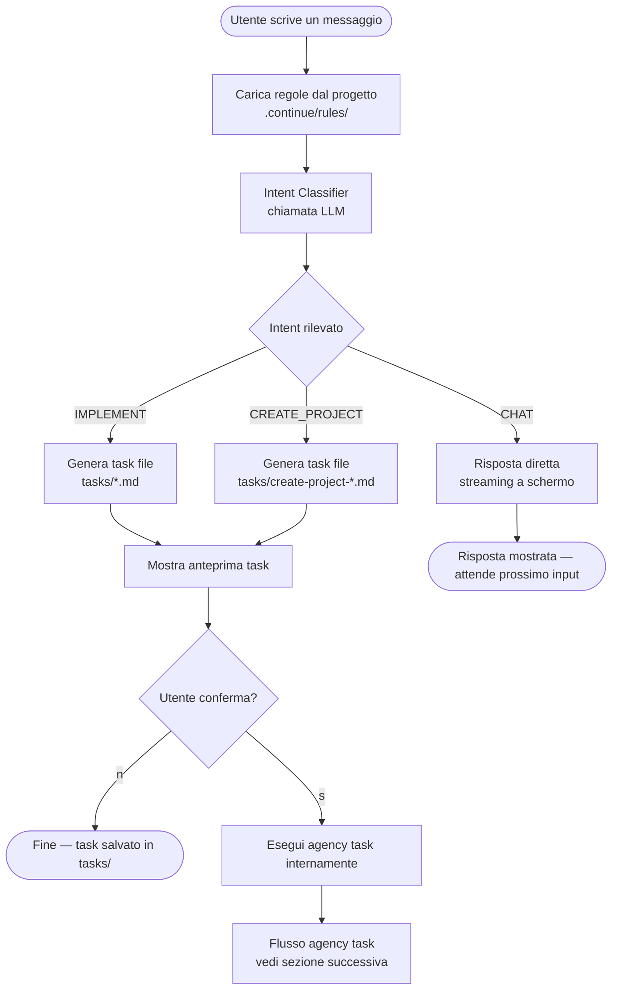
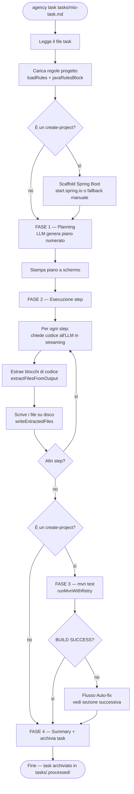
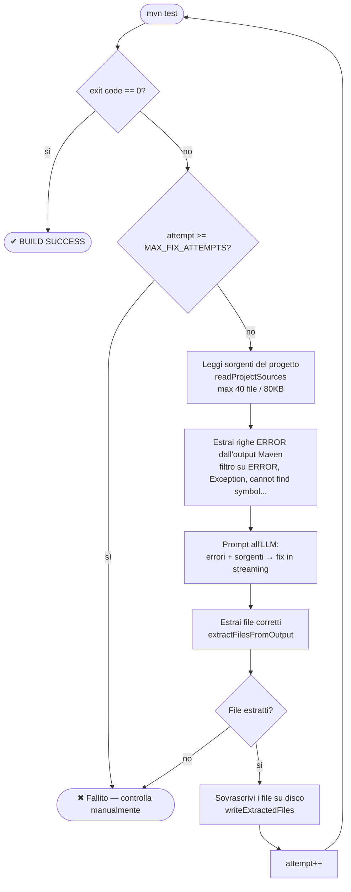
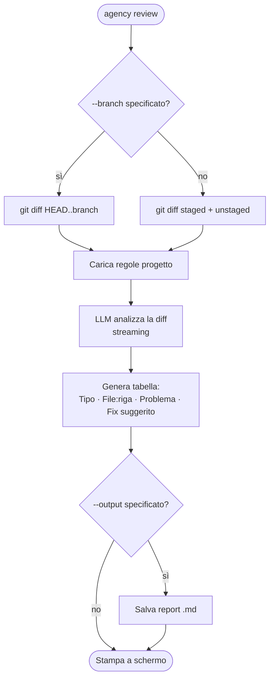
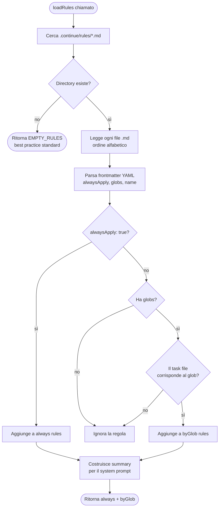

# Agency Dev Assistant

> CLI AI-powered per sviluppatori. Si connette a qualsiasi provider OpenAI-compatibile e lavora nel contesto del tuo progetto, seguendo le tue regole di sviluppo.

---

## Indice

- [Come funziona](#come-funziona)
- [Architettura](#architettura)
- [Install](#install)
- [Quick Start](#quick-start)
- [Comandi](#comandi)
- [Flusso: `agency chat`](#flusso-agency-chat)
- [Flusso: `agency task`](#flusso-agency-task)
- [Flusso: Auto-fix su errori di build](#flusso-auto-fix-su-errori-di-build)
- [Flusso: `agency review`](#flusso-agency-review)
- [Flusso: Caricamento regole](#flusso-caricamento-regole)
- [Crea un nuovo progetto Spring Boot](#crea-un-nuovo-progetto-spring-boot)
- [Regole del progetto](#regole-del-progetto)
- [Code Review](#code-review)
- [Configurazione provider](#configurazione-provider)
- [Configurazione proxy](#configurazione-proxy)
- [Struttura del progetto](#struttura-del-progetto)
- [Personalizzazione CLI](#personalizzazione-cli)

---

## Come funziona

Agency è una CLI che funge da **agente AI locale** per il tuo progetto. Non è un semplice wrapper attorno a un LLM: costruisce un contesto strutturato (regole, task, sorgenti) e orchestra l'LLM per produrre codice funzionante, verificato e conforme alle linee guida del tuo team.

Il flusso di base è:

```
Utente → CLI → Rules Loader → LLM (streaming) → File Writer → (mvn test) → Output
```

Ogni comando carica le **regole** del progetto da `.continue/rules/`, le inietta nel system prompt e poi interagisce con l'LLM scelto via API OpenAI-compatibile.

---

## Architettura

```
agency-cli/
├── src/
│   ├── cli.js              ← Entry point: registra tutti i comandi (Commander.js)
│   ├── brand.js            ← Nome CLI, versione, colore primario
│   ├── agency-config.js    ← Lettura/scrittura ~/.agency/config.yaml
│   ├── config.js           ← Helper configurazione
│   ├── network.js          ← Proxy helper: applyProxyFromConfig + buildContinueEnv
│   ├── roles.js            ← Definizione ruoli (developer, pm, ticket-manager)
│   ├── utils.js            ← Spinner, clearLine, helper terminale
│   ├── commands/
│   │   ├── chat.js         ← agency chat: intent detection + task generation
│   │   ├── task.js         ← agency task: planning + step execution + auto-fix
│   │   ├── review.js       ← agency review: git diff → code review LLM
│   │   ├── init.js         ← agency init: analisi progetto + seed regole
│   │   ├── models.js       ← agency models: configurazione provider interattiva
│   │   ├── run.js          ← agency run: prompt one-shot
│   │   └── rules.js        ← agency rules new/list/from-file
│   └── rules/
│       ├── 01-java-guidelines.md     ← sealed
│       ├── 02-angular-guidelines.md  ← sealed
│       ├── 03-security.md            ← sealed
│       ├── 04-task-runner.md         ← modificabile
│       └── 05-create-project.md      ← sealed
├── install.sh
└── package.json
```

Le **regole sealed** vengono incorporate nel binario al momento dell'install e scritte in `.continue/rules/` ad ogni `agency init`. Non possono essere modificate manualmente (vengono sovrascritte).

---

## Install

```bash
git clone https://github.com/lorenzomariabruni/cli agency-cli
cd agency-cli
bash install.sh
```

Supporta: **macOS**, **Linux**, **Windows (Git Bash / WSL)**.

---

## Quick Start

```bash
# 1. Configura il provider AI
agency models

# 2. Entra nel tuo progetto e inizializzalo
cd mio-progetto
agency init

# 3. Avvia la chat intelligente
agency chat
```

---

## Comandi

| Comando | Descrizione |
|---|---|
| `agency chat` | Chat interattiva con intent detection automatica |
| `agency models` | Configura provider AI e seleziona modello |
| `agency init` | Inizializza il progetto (genera rules + project overview) |
| `agency task <file>` | Implementa un task da file `.md` con esecuzione step-by-step |
| `agency review` | Code review della diff git corrente |
| `agency rules new` | Crea una nuova regola guidata per il progetto |
| `agency rules list` | Elenca le regole attive nel progetto |
| `agency rules from-file <file>` | Genera una regola da un PDF o DOCX |
| `agency run <prompt>` | Prompt one-shot non interattivo |
| `agency mcp:add <server>` | Aggiunge un server MCP (jira, github, postgres...) |
| `agency mcp:list` | Lista server MCP configurati |
| `agency mcp:query <prompt>` | Interroga i dati dai server MCP |

---

## Flusso: `agency chat`

La chat non è una semplice conversazione: ogni messaggio viene classificato da un **intent classifier** (una chiamata LLM rapida) che decide se rispondere direttamente oppure generare un task da eseguire.



### Intent detection

L'intent viene classificato tra tre categorie:

| Intent | Quando | Segnali tipici |
|---|---|---|
| `CHAT` | Domanda, debug, spiegazione, review | "come funziona", "perché", "spiega", "cos'è" |
| `IMPLEMENT` | Modifica su progetto esistente | "crea", "aggiungi", "implementa", "scrivi", "refactora" |
| `CREATE_PROJECT` | Nuovo progetto da zero | "nuovo progetto spring", "crea un app", "bootstrap", "genera uno starter" |

I task `CREATE_PROJECT` producono sempre file con prefisso `create-project-`, che attiva automaticamente la regola sealed `05-create-project`.

### Opzioni

```bash
agency chat --role developer     # ruolo developer (default)
agency chat --role pm             # ruolo project manager
agency chat --role ticket-manager
```

---

## Flusso: `agency task`

`agency task <file>` implementa un task in tre fasi sequenziali: planning, esecuzione step-by-step, e (se è un `create-project`) lancio dei test con auto-fix.



### Estrazione dei file dal codice LLM

L'agente riconosce i file da scrivere analizzando i blocchi di codice nella risposta LLM. Ogni blocco deve avere il percorso del file come **prima riga commentata**:

```java
// ecommerce-service/src/main/java/com/example/ProductController.java
package com.example;
...
```

Senza questa riga, il file non viene scritto su disco.

---

## Flusso: Auto-fix su errori di build

Quando `mvn test` fallisce, l'agente non si ferma: entra in un **loop di auto-fix** che tenta di correggere gli errori usando l'LLM, fino a `MAX_FIX_ATTEMPTS = 3` tentativi.



### Cosa vedi a schermo

```
  ┌──────────────────────────────────────────────────────────────────────────┐
  │ ⚙  mvn test — Fix automatico 1/3                                         │
  └──────────────────────────────────────────────────────────────────────────┘

  [ERROR] ProductService.java:[42] cannot find symbol: method findAll()
  [ERROR] BUILD FAILURE

  ✖ BUILD FAILED (tentativo 1/4)

  ┌──────────────────────────────────────────────────────────────────────────┐
  │ 🔧  Auto-fix 1/3 — Analisi errori in corso...                            │
  └──────────────────────────────────────────────────────────────────────────┘

  Streaming fix in corso...

  // ecommerce-service/src/main/java/com/example/ProductRepository.java
  ...

  └ ✔ ecommerce-service/src/main/java/com/example/ProductRepository.java [fixato]

  ✔ mvn test — BUILD SUCCESS (dopo 1 fix)
```

---

## Flusso: `agency review`



```bash
agency review                    # diff non committata
agency review --branch main      # diff rispetto a main
agency review -o reports/rev.md  # salva il report
```

---

## Flusso: Caricamento regole

Ogni comando che interagisce con l'LLM esegue prima `loadRules()` per costruire il contesto di sistema. Le regole vengono selezionate in base al task file attivo.



### Priorità delle regole

Le regole `alwaysApply: true` sono sempre iniettate nel system prompt, indipendentemente dal task. Le regole con `globs` si attivano solo se il percorso del task file corrisponde al pattern. Le regole Java/Spring vengono estratte separatamente da `javaRulesBlock()` e posizionate in cima al system prompt nei task `create-project`.

---

## Crea un nuovo progetto Spring Boot

La regola `05-create-project` è **sealed** e si attiva automaticamente quando il task file segue il pattern `tasks/create-project*.md`.

### Come usarla

**1. Entra nella cartella workspace:**

```bash
cd ~/progetti
```

**2. Inizializza agency:**

```bash
agency init
```

**3. Crea il file task:**

```markdown
# tasks/create-project-ecommerce.md

## Project info
- artifactId: ecommerce-service
- groupId: com.mycompany
- package: com.mycompany.ecommerce
- Spring Boot version: 3.3.6
- Java version: 21

## Features richieste
- Gestione prodotti: CRUD su entità Product (id, name, price, stock)
- Endpoint REST su /api/products
- Validazione input con Bean Validation
- JPA + H2 per sviluppo locale

## Test da eseguire
- ProductServiceImplTest: unit test con Mockito
- ProductControllerTest: @WebMvcTest slice test
- EcommerceApplicationTests: context load
```

**4. Lancia il task:**

```bash
agency task tasks/create-project-ecommerce.md
```

L'agente esegue in sequenza:

```
  📌 Task: create-project-ecommerce.md  [regola: 05-create-project • sealed]

  ✔ Scaffold: ecommerce-service/  [start.spring.io]

  Piano:
    1. Genera pom.xml con dipendenze
    2. Genera entry point EcommerceServiceApplication.java
    3. Genera model Product + DTO + validazioni
    4. Genera ProductRepository + ProductService + ProductServiceImpl
    5. Genera ProductController con endpoint REST
    6. Genera GlobalExceptionHandler (@ControllerAdvice)
    7. Genera test unitari e slice test

  ▶ Step 1/7: Genera pom.xml con dipendenze
  ...

  ⚙  Fase 3 — mvn test

  ✔ mvn test — BUILD SUCCESS

  🚀 Per avviare il progetto:
     cd ecommerce-service && mvn spring-boot:run
```

### Pattern file task validi

| Pattern file | Attiva la regola? |
|---|---|
| `tasks/create-project-ecommerce.md` | ✔ sì |
| `tasks/create-project-auth.md` | ✔ sì |
| `tasks/new-project-orders.md` | ✔ sì |
| `tasks/user-service.md` | ✘ no (usa 04-task-runner) |

---

## Regole del progetto

Le regole si trovano in `.continue/rules/` e vengono caricate automaticamente. Ogni regola è un file Markdown con frontmatter YAML.

### Regole predefinite (generate da `agency init`)

| File | Tipo | Descrizione |
|---|---|---|
| `00-project-overview.md` | auto-generato | Overview del progetto analizzato da `agency init` |
| `01-java-guidelines.md` | sealed | Best practice Java: naming, struttura, error handling, sicurezza |
| `02-angular-guidelines.md` | sealed | Best practice Angular 17+: standalone, signals, OnPush, Jest |
| `03-security.md` | sealed | Regole di sicurezza cross-cutting |
| `04-task-runner.md` | modificabile | Processo di esecuzione dei task |
| `05-create-project.md` | sealed | Crea un progetto Spring Boot da zero + esegue JUnit |

> Le regole **sealed** vengono riscritte ad ogni `agency init` e non possono essere modificate permanentemente.

### Creare una nuova regola (wizard)

```bash
agency rules new
```

Wizard interattivo:

```
  ❖ Nuova regola

  Nome della regola: Angular Feature Rules
  Descrizione breve: Regole per nuovi componenti Angular in src/app/features
  Sempre attiva? [s/n]: n
  Glob pattern (es: src/app/**/*.ts): src/app/features/**/*.ts

  Contenuto della regola (termina con ---):
  - Usa sempre standalone: true
  - ChangeDetectionStrategy.OnPush obbligatorio
  ---

  ✓ Regola creata: .continue/rules/06-angular-feature-rules.md
```

### Creare una regola da PDF o DOCX

```bash
agency rules from-file <file> [--name <nome>] [--always]
```

La CLI estrae il testo dal file (tramite `pdf-parse` per PDF e `mammoth` per DOCX), lo invia all'LLM con un prompt dedicato e genera automaticamente un file `.continue/rules/NN-<slug>.md` con frontmatter valido per Continue.

```bash
# Da un PDF con linee guida architetturali
agency rules from-file ./docs/coding-standards.pdf

# Da un DOCX con nome custom, sempre attiva
agency rules from-file ./architettura.docx --name "Architettura Microservizi" --always
```

Output tipico:

```
  ⊗ Estrazione testo da coding-standards.pdf... ✔
  Testo estratto: 8.432 caratteri

  ⊗ Analisi con LLM... ✔

  ✓ Regola creata: .continue/rules/05-coding-standards.md
  Sorgente:   coding-standards.pdf
  Caratteri estratti: 8.432
  Caratteri regola:   2.187

  Anteprima:
  ---
  name: Coding Standards
  description: Standard di codice aziendali estratti dal documento
  alwaysApply: true
  ---
  ...
```

### Elencare le regole attive

```bash
agency rules list
```

```
  Regole attive in .continue/rules/

  ❖ 00-project-overview.md       [always]
  ❖ 01-java-guidelines.md        [always]  [sealed]
  ❖ 02-angular-guidelines.md     [always]  [sealed]
  ❖ 03-security.md               [always]  [sealed]
  ❖ 04-task-runner.md            [glob: tasks/**/*.md]
  ❖ 05-create-project.md         [glob: tasks/create-project*.md]  [sealed]
  ❖ 06-angular-feature-rules.md  [glob: src/app/features/**/*.ts]
```

---

## Code Review

```bash
# Review della diff non committata
agency review

# Review rispetto a un branch
agency review --branch main

# Salva il report
agency review -o reports/review.md
```

Output:

```
  🔍 Code Review in corso...

  | Tipo     | File:riga           | Problema                   | Fix suggerito         |
  |----------|---------------------|----------------------------|-----------------------|
  | SECURITY | UserService.java:42 | Password loggata in chiaro | Rimuovi il log        |
  | STYLE    | OrderCtrl.java:18   | Metodo supera 30 righe     | Estrai metodo privato |

  ⚠ Verdetto: CHANGES_REQUESTED
```

---

## Configurazione provider

```bash
agency models
```

File di configurazione: `~/.agency/config.yaml`

```yaml
provider:
  url: "https://openrouter.ai/api/v1"
  api_key: "sk-or-..."
  model: "nvidia/nemotron-super-49b-v1:free"
```

### Provider supportati

| Provider | URL |
|---|---|
| OpenAI | `https://api.openai.com/v1` |
| OpenRouter | `https://openrouter.ai/api/v1` |
| Ollama (locale) | `http://localhost:11434/v1` |
| LM Studio (locale) | `http://localhost:1234/v1` |
| Groq | `https://api.groq.com/openai/v1` |
| Azure OpenAI | `https://<resource>.openai.azure.com/openai/deployments/<model>` |

---

## Configurazione proxy

In reti aziendali o ambienti con proxy autenticato, Continue CLI può andare in timeout se `HTTP_PROXY` e `HTTPS_PROXY` non sono impostati. Agency gestisce questo automaticamente.

### Wizard al primo avvio

Alla **prima esecuzione** di qualsiasi comando Agency (esclusi `models`, `setup`, `--help`), viene mostrato un wizard una tantum che chiede se configurare un proxy:

```
  ─────────────────────────────────────────────────────────────────────
  Configurazione proxy (prima esecuzione)

  Continue CLI potrebbe andare in timeout in reti aziendali senza proxy.
  Questa configurazione verrà salvata e non verrà più chiesta.

  Vuoi configurare un proxy HTTP/HTTPS per Continue? [s/N]: s
  HTTP_PROXY  (es: http://proxy.azienda.local:8080): http://proxy.corp:3128
  HTTPS_PROXY (es: http://proxy.azienda.local:8080): [http://proxy.corp:3128]
  NO_PROXY    (host esclusi dal proxy): [localhost,127.0.0.1]

  ✓ Proxy salvato nel config
    HTTP_PROXY  → http://proxy.corp:3128
    HTTPS_PROXY → http://proxy.corp:3128
    NO_PROXY    → localhost,127.0.0.1

  Puoi modificarlo in seguito con: agency models
  ─────────────────────────────────────────────────────────────────────
```

Se si risponde **N**, il wizard non viene più mostrato e il proxy non viene configurato. È possibile configurarlo in seguito tramite `agency models`.

### Come viene propagato

Il proxy salvato viene applicato a **due livelli**:

| Livello | Meccanismo | Cosa copre |
|---|---|---|
| **fetch() interne** | `EnvHttpProxyAgent` (undici) + `process.env` | Chiamate API al provider LLM da Agency |
| **Processi figli** | `buildContinueEnv()` in `network.js` | Continue CLI e tool lanciati via `execa()` |

Nei comandi che lanciano processi figli (es. `agency task`, `agency run`), l'env passato a `execa()` include sempre `HTTP_PROXY`, `HTTPS_PROXY` e `NO_PROXY` se configurati, evitando timeout di Continue.

### Configurazione manuale

Il proxy è salvato in `~/.agency/config.yaml`:

```yaml
provider:
  url: "https://openrouter.ai/api/v1"
  api_key: "sk-or-..."
  model: "gpt-4o"

proxy:
  configured: true
  http: "http://proxy.azienda.local:8080"
  https: "http://proxy.azienda.local:8080"
  no_proxy: "localhost,127.0.0.1"
```

Per **disabilitare** il proxy, imposta i campi `http` e `https` come stringa vuota lasciando `configured: true`.

Per **ri-eseguire** il wizard, rimuovi l'intera chiave `proxy` dal file di config.

---

## Struttura del progetto

Dopo `agency init`:

```
mio-progetto/
├── .continue/
│   ├── rules/
│   │   ├── 00-project-overview.md   ← generato da agency init
│   │   ├── 01-java-guidelines.md    ← sealed
│   │   ├── 02-angular-guidelines.md ← sealed
│   │   ├── 03-security.md           ← sealed
│   │   ├── 04-task-runner.md        ← modificabile
│   │   ├── 05-create-project.md     ← sealed
│   │   └── 06-my-custom-rule.md     ← tue regole custom
│   ├── agent.log                    ← log dell'ultima sessione task
│   └── mcpServers/                  ← config server MCP
└── tasks/
    ├── create-project-ecommerce.md  ← crea un progetto da zero
    ├── user-service.md              ← task di implementazione
    └── .processed/                  ← task completati
```

---

## Personalizzazione CLI

Modifica `src/brand.js`:

```js
export const BRAND = {
  cliName:      "agency",
  displayName:  "Agency Dev Assistant",
  version:      "1.0.0",
  primaryColor: "cyan",
};
```
